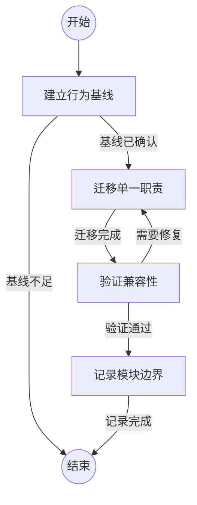

## 建立行为基线

```新建Agent
识别目标模块的公开接口、调用方、状态责任和现有验证。确认可在重构前后比较的行为基线；缺少关键保护时先补充验证，不开始迁移。
```

### 基线已确认

已明确必须保持的接口、行为和验证入口。

### 基线不足

无法建立能识别行为回归的最小验证集合。

## 迁移单一职责

```复用Agent
每次仅迁移一个内聚职责到独立模块，保留原入口作为稳定外观或适配层。迁移后检查依赖方向、状态所有权和错误语义，避免用循环依赖掩盖边界不清。
```

### 迁移完成

职责已迁移，公开契约和依赖方向清晰。

## 验证兼容性

```复用Agent
运行覆盖静态检查、模块测试和端到端行为的验证集合。比较迁移前后接口、错误响应和用户可见结果；将失败定位到最近迁移职责。
```

### 验证通过

验证结果表明公开契约与用户行为保持一致。

### 需要修复

发现行为、接口、错误语义或依赖方向回归，需要回到迁移步骤修复。

## 记录模块边界

```复用Agent
更新实现参考和架构状态，说明各模块的职责、稳定入口和依赖关系。确认新增路径均有归属，并完成架构治理检查。
```

### 记录完成

模块边界和变更影响已被记录并验证。