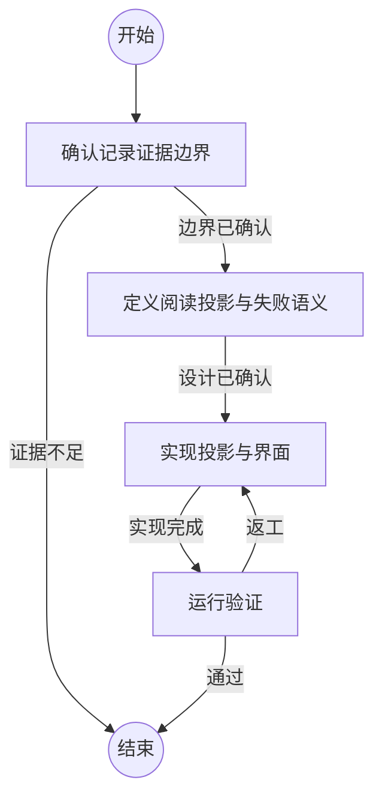

## 确认记录证据边界

```新建Agent
确认哪些事件、字段和时间戳由持久化记录直接证明，哪些内容只能由当前运行环境推断。禁止将推断结果作为历史事实投影。
{outcome}
```

### 边界已确认

已经区分可验证事实和不可验证推断。

### 证据不足

缺少决定投影语义的持久化依据。

## 定义阅读投影与失败语义

```复用Agent
根据已确认事实定义阅读事件、信息层级、缺失记录的展示方式、原始证据跳转和兼容边界。
{outcome}
```

### 设计已确认

投影模型、交互和兼容策略已明确。

## 实现投影与界面

```复用Agent
实现规范化、阅读投影、界面展示和相关文档，保持原始记录只读，并为每类事件保留可定位证据。
{outcome}
```

### 实现完成

代码、测试和文档已完成。

## 运行验证

```复用Agent
验证事实边界、旧记录兼容、阅读可见性、原始证据跳转和所有既有回归门禁。
{outcome}
```

### 通过

所有验证通过，且没有把当前环境推断写成历史事实。

### 返工

存在事实边界、兼容性、交互或回归问题，需要返回实现修正。