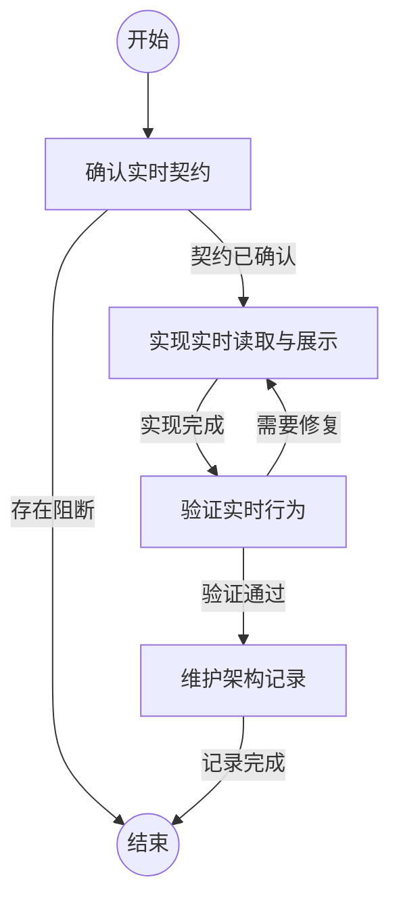

## 确认实时契约

```新建Agent
确认实时功能的权威事件来源、提交边界、文件版本身份、断线恢复语义、授权边界和现有静态阅读兼容条件。缺少任一关键事实时停止实现并记录阻断。
```

### 契约已确认

已确认可保持的事件、文件、连接和阅读契约。

### 存在阻断

缺少会影响正确性或安全边界的关键事实。

## 实现实时读取与展示

```复用Agent
实现增量读取、共享订阅、客户端状态管理和连续展示。只提交完整事实，保持静态阅读的最终权威性，并在会话切换、文件重置和连接关闭时释放资源。
```

### 实现完成

实现已覆盖服务端、浏览器和必要的测试入口。

## 验证实时行为

```复用Agent
运行静态检查、单元测试和端到端测试，验证追加、半写入、断线恢复、文件替换、授权、资源释放和浏览器跟随阅读。失败时定位最近实现步骤并修复。
```

### 验证通过

验证证明实时行为和原有阅读行为均符合契约。

### 需要修复

发现一致性、状态、授权、资源或界面行为回归。

## 维护架构记录

```复用Agent
运行架构影响准备流程，更新受影响的实现参考、模块边界和状态记录，完成检查与生效，确保新增路径均可追溯。
```

### 记录完成

架构记录、影响结论和实现变更均已通过检查。