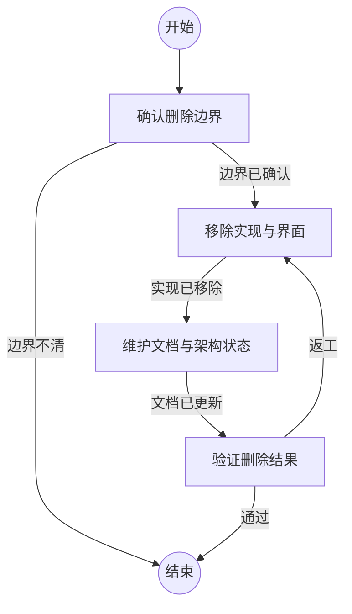

## 确认删除边界

```新建Agent
确认待移除能力的入口、配置、数据流、依赖模块、界面、测试和文档，并明确仍需保留的相邻能力。
{outcome}
```

### 边界已确认

已定位所有可达入口和依赖，并确认保留能力不依赖待移除能力。

### 边界不清

缺少决定保留或删除范围的关键信息。

## 移除实现与界面

```复用Agent
删除已确认边界内的运行入口、配置、实现模块、用户界面和自动化测试，同时收缩保留模块的职责。
{outcome}
```

### 实现已移除

代码不再创建、暴露或调用待移除能力，保留路径可以独立运行。

## 维护文档与架构状态

```复用Agent
更新用户文档、实现参考、模块设计和架构状态，移除已删除能力的描述及失效入口。
{outcome}
```

### 文档已更新

文档和架构状态只描述仍存在的能力和边界。

## 验证删除结果

```复用Agent
运行静态检查、自动化测试和架构治理检查，检索删除能力的残留引用，并确认保留能力可用。
{outcome}
```

### 通过

所有验证通过，且没有可达入口、配置或文档残留。

### 返工

仍存在删除能力的残留、保留能力回归或架构治理未闭合。